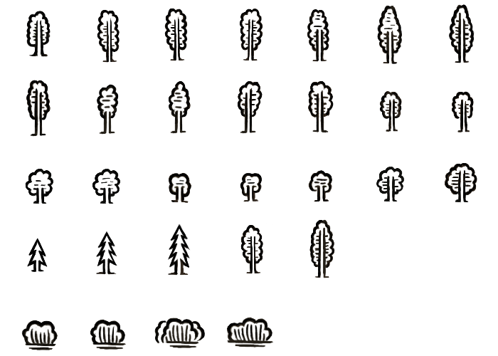
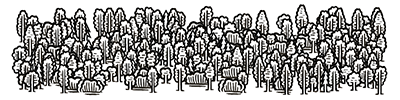

# Forest Generator

The main goal of the task is to create Forest image based on Canvas API.
The approach to achieve the task is free. We want to see how you solve problems and some basic algorithmic skills.

You can use all available resources and libs to achive the task. There are no any specific requirements.

In other words, just provide means to transform this:

into something like this:

